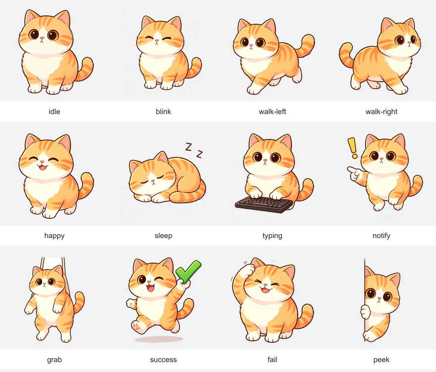
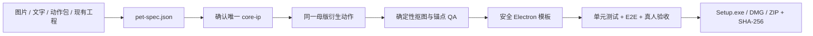

<div align="center">

# Doubao Desktop Pet Builder

**把一张图片、一个角色设定或现成 Electron 工程，变成可验收、可修复、可打包的桌面宠物。**

[](./doubao-desktop-pet-builder/SKILL.md)




面向豆包任务模式的桌宠构建 Skill。覆盖视觉母版、动作资产、Electron 工程、安全边界、自动测试和 Windows/macOS 打包，不止生成几张角色图。

</div>

## 它解决什么

传统桌宠制作的问题通常不在“能不能画一只猫”，而在后面一长串容易失控的环节：角色越画越不像、透明 PNG 是假的、动作锚点乱跳、拖拽在高 DPI 下漂移、面板被塞进透明小窗、打包成功却启动不了。

这个 Skill 把整条链路收束为三个稳定模式：

| 模式 | 输入 | 结果 |
|---|---|---|
| 从零创建 | 单张图片、完整动作包或文字描述 | 核心形象、12 状态素材、Electron 工程、验收报告 |
| 诊断修复 | 已有桌宠/Electron 工程 | 独立修复副本、问题分级、修复证据 |
| 单独打包 | 已通过检查的已有工程 | Windows Setup 或 macOS DMG/ZIP 与 SHA-256 清单 |



## 单图转桌宠，不靠抽卡

用户上传宠物、人物、物品或角色图后，可以选择：

- 保留原貌
- 适度卡通化（默认）
- 只提取标志元素

上传图先通过 `image_edit` 固化为唯一 `core-ip`。用户确认后，所有动作继续引用这张母版；只有纯文字输入的第一次核心形象创建允许使用 `image_gen`。

资产落地采用确定性处理：

- 四角连通背景识别，不做粗暴的全图近白删除
- 去色边、真实 alpha 检查、主体触边门禁
- 统一 512×512 透明 PNG
- 底部中心锚点和安全边距
- 缺帧、触边、锚点漂移自动失败
- 自动生成 12 状态联系表，交给用户集中确认

默认状态：`idle`、`blink`、`walk-left`、`walk-right`、`happy`、`sleep`、`typing`、`notify`、`grab`、`success`、`fail`、`peek`。

## 生成的桌宠有什么

- 透明、无边框、置顶桌宠窗
- Pointer Capture 拖拽与主进程 DIP 坐标计算
- 多屏、缩放和当前工作区贴边
- 系统托盘、提醒、独立数据面板
- 文件口袋与同名文件自动编号
- 设置和提醒的原子持久化
- 唯一状态机和统一计时器生命周期
- 可选全局打字响应：默认关闭，只发送活动脉冲，不记录键值

模板采用 TypeScript、原生 DOM、Webpack 和 Electron Forge，并启用：

- `contextIsolation: true`
- renderer sandbox
- `nodeIntegration: false`
- 严格 CSP 与独立 CSS
- 类型化 `window.petAPI`
- IPC sender 与 payload 校验
- 结构化异常日志

## 快速开始

```bash
git clone https://github.com/fly-YaoPro/doubao-desktop-pet-builder.git
```

正式 Skill 位于：

```text
doubao-desktop-pet-builder/
```

把这个文件夹安装或同步到豆包 Skill 工作区，然后可以直接说：

```text
把我上传的这张宠物照片做成 Windows 桌宠。
保留它的花纹，适度卡通化，提醒、文件口袋和贴边都要。
```

也可以：

```text
检查这个已有 Electron 桌宠，复制成独立修复版。
重点修多屏拖拽、提醒持久化和安全隔离，修完给我证据。
```

```text
不要改功能，只检查这个工程并打包 Windows x64 Setup.exe。
输出版本、架构、大小和 SHA-256 清单。
```

## 确定性工具

```bash
# 校验 pet-spec.json
python scripts/validate_pet_spec.py /path/to/pet-spec.json

# 从模板创建独立工程，默认拒绝覆盖
python scripts/scaffold_project.py \
  --spec /path/to/pet-spec.json \
  --assets /path/to/processed-assets \
  --output /path/to/new-project

# 只读审计已有 Electron 工程
python scripts/audit_project.py /path/to/project --json audit-report.json
```

生成工程提供固定命令：

```bash
npm run dev
npm run check
npm test
npm run qa:assets
npm run test:e2e
npm run test:soak
npm run make:win
npm run make:mac
```

## 实测结果

| 检查 | 当前结果 |
|---|---|
| 豆包官方 `quick_validate.py` | 通过 |
| `pet-spec.json` 校验 | 通过 |
| 模板安全静态审计 | 33 个文件，0 项发现 |
| TypeScript | 通过 |
| 单元测试 | 8/8 通过 |
| 橘猫回归资产 | 12/12 通过 |
| 不透明背景到透明资产流水线 | 13/13 处理成功，12/12 QA 通过 |
| Playwright Electron E2E | 通过 |
| Windows x64 Forge Package | 通过 |
| Squirrel `Setup.exe` | 通过，SHA-256 清单已生成 |

完整证据见 [实施与验证报告](./evaluation/doubao-desktop-pet-builder/implementation-report.md)。

<div align="center">
  
</div>

## 仓库结构

```text
.
├── README.md
├── doubao-desktop-pet-builder/       # 可直接安装/提审的正式 Skill
│   ├── SKILL.md
│   ├── scripts/                      # spec 校验、脚手架、项目审计
│   ├── references/                   # 工作流、资产规则、安全与验收门禁
│   └── assets/
│       ├── electron-template/        # 安全 Electron Forge 模板
│       └── regression-fixture/       # 最小离线回归夹具
└── evaluation/doubao-desktop-pet-builder/
    ├── expected-truth.json
    ├── showcase-five-round.md
    ├── expert-repair-regression.md
    ├── packaging-regression.md
    └── evidence/
```

## 当前边界

- Windows 默认输出未签名 x64 `Setup.exe`。
- macOS 只在真实 Mac 上构建当前机器架构的未签名 DMG 与 ZIP/App。
- v1 不承诺代码签名、公证、应用商店、Universal、自动更新、云同步、账号、语音或联网 AI 对话。
- Mac 真人验收、两端正式 60 分钟稳定性测试和豆包安装后的三组前向测试仍需在对应环境完成。
- 橘猫素材只作离线回归，不会默认进入用户生成的桌宠。
- 使用用户上传图片和公开发布回归素材前，请确认相应授权。

## 状态说明

这是面向豆包任务模式的提审版本，不代表已经获得字节跳动或豆包官方背书。仓库当前未指定开源许可证；未获得明确授权前，请勿默认复制、分发或商用其中的代码与素材。

---

**English:** A production-oriented Doubao Skill for creating, repairing and packaging secure Electron desktop pets from a single image, an action pack, a text description or an existing project.
